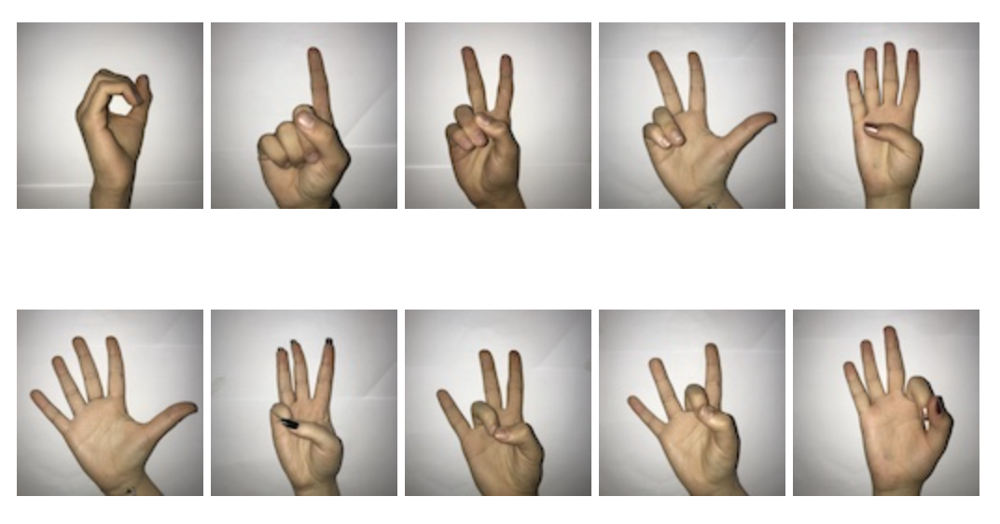
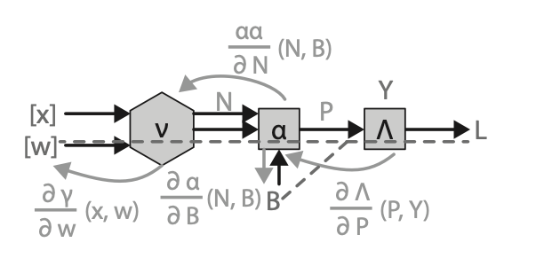
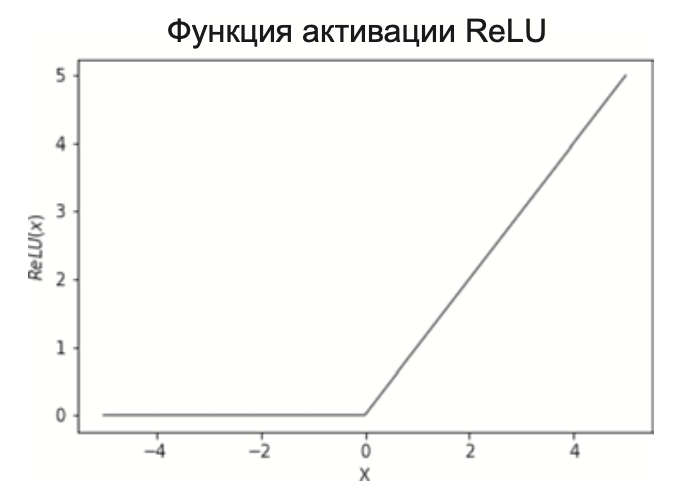
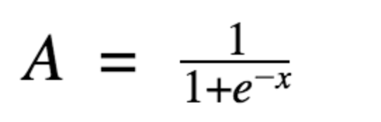
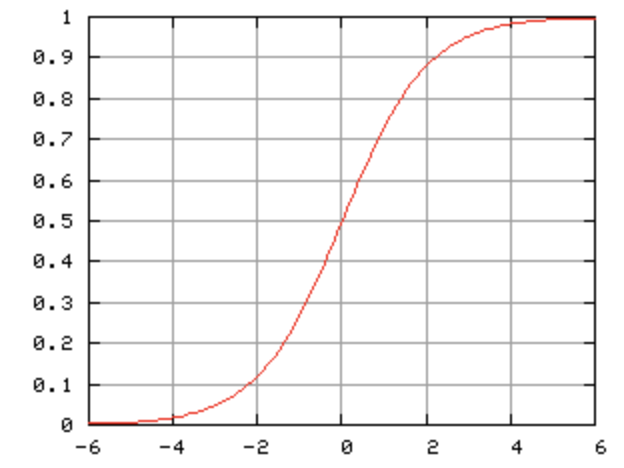
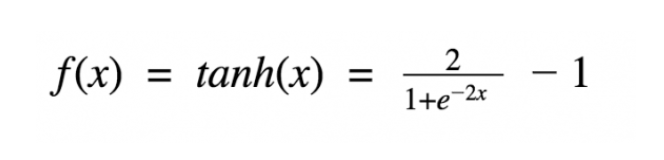
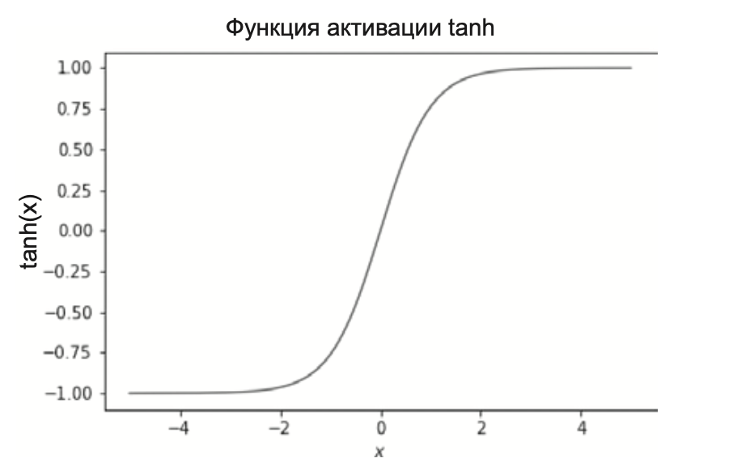
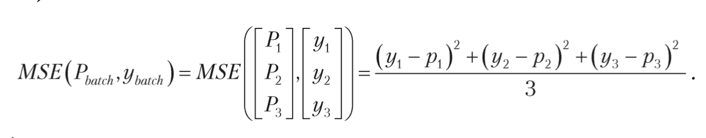
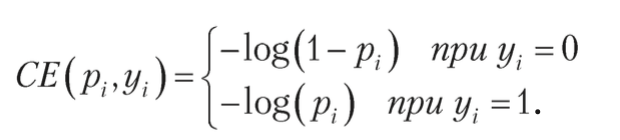
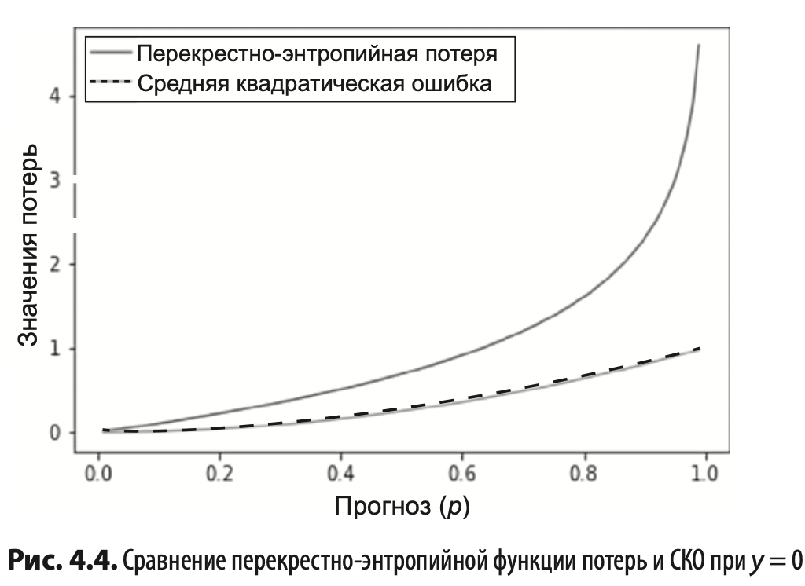

# Проектирование программных систем (практика)

### Содержание
1) Титульный лист (образец загружен в ЛК)
2) Оглавление
3) Цель работы в соответствии с вариантом
4) Исходные данные и их описание
5) Теоретический раздел
6) Практический раздел
7) Результаты
8) Выводы
9) Список литературы

#### Оглавление

Задание: Произвести классификацию изображения, с помощью нейронной сети

#### Цель работы

Цель данной работы заключается в том, чтобы произвести классификацию изображения с использованием нейронной сети.
Конкретнее, задачей является обучение нейронной сети на большом наборе размеченных изображений,
после чего использование этой сети для автоматической классификации новых, неизвестных изображений
на определенное число заранее заданных категорий.


#### Исходные данные

Датасет Sign Language Digits Dataset [https://www.kaggle.com/datasets/ardamavi/sign-language-digits-dataset]  
Содержит изображения 10 цифр выраженное в жестах
Формат изображения: 64x64
Цвет: серый (одноканальный)
Количество: 218 * 10



#### Теоретический раздел

Нейросеть - это математическая функция, которая принимает входные и производит выходные данные.

Глубокое обучение:
1. Пропустить наблюдения через модель, отслеживая величины, вы- численные по пути во время этого «прямого прохода».
2. Рассчитать потери, показывающие, насколько прогнозы нашей модели отличаются от целевых результатов.
3. Используя величины, вычисленные на прямом проходе, и цепное правило, описанное в главе 1, вычислить, как сильно каждый из входных параметров влияет на величину ошибки.
4. Изменить значения параметров, чтобы при повторном проходе ошибка стала меньше.

Основные параметры:

Bias - смешения - позволяет модели учитывать различия в данных и изучать более гибкие границы решений. Используется для сдвига вывода функции активации в определенном направлении.
Основная причина использования смещения в нейронных сетях — улучшить способность модели соответствовать данным.
Вводя член смещения, модель может учитывать различия в данных, которые не фиксируются только входными признаками.
Это может помочь модели лучше обобщать новые данные и уменьшить влияние переобучения.

Weight -  веса определяют вклад каждого нейрона в конечный результат. 

Суть обучения - пропустить данные напрямую через функции, по полученным данным взять производную 
для расчета градиента (пропустить данные в обратном направлении), полученные результаты сравнить с целевым
значением и скорректировать веса для последующего прямого прохода

Диаграмма обучения модели



Прямой проход - слева направо
Обратный проход - вычисление частных производные каждой из вложенных функций,
двигаясь изнутри наружу, а затем оценка их для значений, полученных во время прямого прохода.

Функции активации:
Релу - Rectified Linear Unit

> A(x) = max(0,x)



Сигмоида



Гиперболический тангенс



Потери:

Среднеквадратические



Перекрестно-энтропийная потеря - имеет больший градиент и соответственно больший штраф для сети, которая делает прогноз более точным.




Оптимизации:

Стохастический градиентный оптимизатор
С помощью производной потери по весам смещение значения весов в направлении градиента.

Стохастический градиентный оптимизатор с инерцией

Величина обновления на каждом шаге будет вычисляться как средневзвешенное значение от предыдущих обновлений,
причем веса будут уменьшаться в геометрической прогрессии от недавних к давним

Классификация изображений - это задача, в которой требуется разделить изображения на несколько категорий. 
Для решения этой задачи используются нейронные сети, в том числе многослойные перцептроны.

Перцептро́н— математическая или компьютерная модель восприятия информации мозгом.

Многослойный перцептрон - это нейронная сеть, состоящая из нескольких слоев, каждый из которых состоит из нескольких нейронов.
Входные данные передаются через каждый слой с помощью весовых коэффициентов, которые определяют, как каждый нейрон
будет реагировать на входные данные. Каждый нейрон в слое использует функцию активации для принятия решения о том,
какой результат он должен выдать.


#### Практический раздел

Все основные операции наследуются от класс Operation, который определяет наличие у этих классов методов
forward(прямой проход) и backward(обратный проход)

Если в операции участвуют дополнительные параметры, например операция применения весов и смещения,
то они наследуются от класса ParamOperation, в котором дополнительно определяют получение градиента 
для дополнительных параметров


В результате мы получаем вот такую модель:

```python
model = NeuralNetwork(
    layers=[Dense(neurons=202,
                  activation=Tanh(), weight_init="glorot", dropout=0.9),
            Dense(neurons=101,
                  activation=Tanh(),
                  weight_init="glorot",
                  dropout=0.9),
            Dense(neurons=10,
                  activation=Linear(), weight_init="glorot")],
            loss = SoftmaxCrossEntropy(),
seed=14881337)

trainer = Trainer(model, SGDMomentum(lr = 0.01, momentum = 0.9, final_lr=0.05, decay_type='exponential'))
trainer.fit(x_params_train, y_ans_train, x_params_test, y_ans_test,
            epochs = 50,
            eval_every = 10,
            seed=14881337,
            batch_size=60)
```
Модель состоит из трех слоев
Первый слой 202 нейрона с гиперболическим тангенсом в качестве функции активации
Второй слой 101 нейрон с гиперболическим тангенсом в качестве функции активации
Третий слой 10 нейронов равное количеству исследуемых результатов

На 1 и 2 слое применен дропдаун
Потери вычисляются кросс-энтропийно
В процессе обучения используется стохастический оптимизатор с инерцией и затухающей скоростью обучения


#### Результаты
> Validation loss after 10 epochs is 1.058
> Validation loss after 20 epochs is 1.012
> Loss increased after epoch 30, final loss was 1.012, 
> using the model from epoch 20
> The model validation accuracy is: 82.08%

В ходе обучения модели удалось достичь Х точности. Полученные веса сохранены для оценки модели на реальных даннных.
Было сделано и обработанно 10 изображений, результаты работы модели:


#### Выводы
В ходе выполенения работы написана модель глубокого обучения, способная распознавать жесты на фотографиях, обозначающие числа.
Удалось добиться точности модель Х%, которые подвердились на реальных данных. Также были изучены основные подходы
к обучению нейросетевых моделей, с помощью которых удалось получить такие результаты

#### Список литературы
> Сет Вейдман, Глубокое обучение Легкая разработка проектов на Python